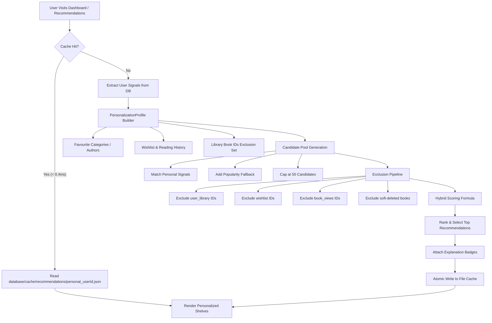

# BookSphere — Architectural Specification & System Design

**System**: BookSphere — Intelligent Book Discovery & Social Reading Platform  
**Target Environment**: PHP 8.2+, SQLite 3, Windows / Linux  
**Status**: Architecture Frozen & Verified  

---

## 1. High-Level Architectural Pattern

BookSphere is engineered according to the **Layered Model-View-Controller (MVC)** architectural pattern, augmented with explicit **Service**, **Repository**, **DTO**, and **Presenter** layers.

```
┌─────────────────────────────────────────────────────────────────────────┐
│                           Client Browser                                │
└────────────────────────────────────┬────────────────────────────────────┘
                                     │ HTTP Request
                                     ▼
┌─────────────────────────────────────────────────────────────────────────┐
│                public/index.php (Front Controller)                      │
│                  Loads bootstrap/app.php & runs                         │
└────────────────────────────────────┬────────────────────────────────────┘
                                     │
                                     ▼
┌─────────────────────────────────────────────────────────────────────────┐
│                         Middleware Pipeline                             │
│     SecureHeaders -> Guest/Auth/Admin Middleware -> CsrfMiddleware      │
└────────────────────────────────────┬────────────────────────────────────┘
                                     │ Validated Request
                                     ▼
┌─────────────────────────────────────────────────────────────────────────┐
│                     Router (routes/web.php)                             │
│               Matches URL pattern & dispatches to                       │
└────────────────────────────────────┬────────────────────────────────────┘
                                     │
                                     ▼
┌─────────────────────────────────────────────────────────────────────────┐
│                           Controllers                                   │
│    Thin orchestrators: validate input, call services, return response   │
└──────────────────┬───────────────────────────────────┬──────────────────┘
                   │                                   │
                   ▼                                   ▼
┌─────────────────────────────────────┐ ┌─────────────────────────────────┐
│          Service Layer              │ │        Presenters & DTOs        │
│   Business logic, orchestration,    │ │   Transforms entities into      │
│   recommendation scoring, policies  │ │   view-optimized data models    │
└──────────────────┬──────────────────┘ └────────────────┬────────────────┘
                   │                                     │
                   ▼                                     │
┌─────────────────────────────────────┐                  │
│         Repository Layer            │                  │
│   Pure SQL, PDO prepared stmts,     │                  │
│   batch hydration, zero business logic                 │
└──────────────────┬──────────────────┘                  │
                   │                                     │
                   ▼                                     │
┌─────────────────────────────────────┐                  │
│        Database / Storage           │                  │
│   SQLite 3 (database/booksphere.db) │                  │
│   File Cache (database/cache/)      │                  │
└─────────────────────────────────────┘                  │
                                                         ▼
┌─────────────────────────────────────────────────────────────────────────┐
│                             View Layer                                  │
│             PHP Native Templates, Component Partials, CSS/JS            │
└─────────────────────────────────────────────────────────────────────────┘
```

### Core Architectural Axioms
1. **Controllers Write Zero SQL**: Controllers only accept HTTP requests, delegate processing to domain services, and return responses.
2. **Repositories Own All Persistence**: SQL queries and PDO prepared statements reside exclusively inside Repository classes.
3. **No Per-Book N+1 Queries**: All relational data (authors, categories, ratings) are hydrated using bulk array keys and SQL `IN (?, ...)` queries.
4. **All Output Escaped by Default**: The view layer strictly formats untrusted input with the `e()` helper (`htmlspecialchars($v, ENT_QUOTES | ENT_SUBSTITUTE, 'UTF-8')`).
5. **Pure Native PHP**: Zero external framework dependencies. Core routing, dependency injection, session handling, validation, and templating are implemented as lightweight, transparent classes.

---

## 2. Directory Structure & Subsystem Organization

```text
booksphere/
├── app/
│   ├── Controllers/        # HTTP Request handlers (20 controllers)
│   ├── Core/               # Framework foundation (Application, Router, Database, Session, etc.)
│   ├── DTO/                # Strongly-typed Data Transfer Objects (18 DTOs)
│   ├── Helpers/            # Global utility functions (root_path, e, asset, config)
│   ├── Middleware/         # Request lifecycle filters (Auth, Admin, Csrf, Headers)
│   ├── Models/             # Entity domain representations (19 models)
│   ├── Presenters/         # View composition models (RecommendationDashboard, ReviewList, Chart)
│   ├── Repositories/       # Data access layer & SQL operations (16 repositories)
│   ├── Requests/           # Input validation rules
│   ├── Services/           # Domain business logic & external integrations (38 services)
│   ├── Strategies/         # Recommendation strategy algorithms (Strategy Pattern)
│   └── Views/              # Native PHP templates, layouts, and components
├── bootstrap/              # Bootstrap lifecycle (constants.php, app.php)
├── config/                 # Domain configuration files (recommendations, database, etc.)
├── database/
│   ├── booksphere.db       # Primary SQLite 3 database
│   ├── cache/              # File caches (recommendations, google_books)
│   └── migrations/         # 37 relational database migration files
├── docs/                   # System documentation, specifications, and runbooks
├── public/                 # Web document root (index.php, .htaccess, assets, uploads)
│   └── assets/             # Modular CSS, JS, and SVG icons
├── storage/                # Application logs and file buffers
└── tests/                  # 52 standalone automated test suites
```

---

## 3. The Recommendation Engine Architecture

The recommendation engine is BookSphere's core technical differentiator. It computes personalized book suggestions using a **hybrid multi-factor scoring model**, candidate filtering, and a resilient multi-tier caching system.



### 3.1 Scoring Formulas & Tunable Weights

The hybrid score (0–100) is calculated for each candidate book using weights defined in [`config/recommendations.php`](file:///d:/PROJECTS/booksphere/config/recommendations.php):

#### Standard Personalization Formula
```text
HybridScore = (CategoryAffinity * 0.40)
            + (AuthorAffinity   * 0.25)
            + (WishlistMatch    * 0.10)
            + (RatingHistory    * 0.10)
            + (CommunityReview  * 0.10)
            + (SocialEngagement * 0.05)
            + (Popularity       * 0.00)
```
- **Category Affinity (40%)**: Matches the user's top categories derived from finished books and wishlist saves.
- **Author Affinity (25%)**: Matches authors followed or rated highly by the user.
- **Wishlist Match (10%)**: Similarity to books saved on the user's wishlist.
- **Reading History (10%)**: Similarity to books given 4-star or 5-star ratings.
- **Review Quality (10%)**: Community rating quality (normalized 0–1 average rating).
- **Social Engagement (5%)**: Book engagement across community posts and discussions.
- **Popularity (0%)**: Guaranteed zero weight so community popularity never overrides individual user preferences.

#### Library-Derived Scoring Formula
For shelf recommendations on the library and dashboard surfaces:
- **Favourite Category**: 35%
- **Favourite Author**: 25%
- **Reading History (Finished)**: 15%
- **Want-to-Read Similarity**: 10%
- **Review Score**: 10%
- **Popularity**: 5%

### 3.2 Candidate Pool & Exclusion Pipeline
To guarantee sub-10ms computation, BookSphere never evaluates the entire 535-book catalogue:
1. **Candidate Pool Bounding**: Exactly 50 candidate books are extracted per user (20 matching category affinities, 20 matching author affinities, 10 popularity fallbacks).
2. **Strict Library Exclusion**: Books present in the user's `user_library` table across **all 5 statuses** (`want_to_read`, `currently_reading`, `finished`, `on_hold`, `dropped`) are strictly excluded via `$profile->libraryBookIds`.
3. **Wishlist & View Exclusion**: Wishlist items and recently viewed books are filtered out.
4. **Soft-Deleted Exclusion**: Drafts and soft-deleted books (`deleted_at IS NOT NULL`) are pruned.

### 3.3 Cold-Start Strategy
When a new reader registers without any reading history or wishlist items:
- The engine detects an empty personalization profile.
- It seamlessly serves high-confidence baseline candidates using the `HighestRatedStrategy`, `TrendingBooksStrategy`, and `PopularBooksStrategy`.
- Recommendations display transparent badges such as `"Community Favourite"` or `"Top Rated Overall"`.

### 3.4 Caching & Invalidation Architecture
- **Location**: `database/cache/recommendations/personal_{userId}.json`.
- **Atomic File Writes**: Recommendations are serialized to a temporary file (`tempnam()` / `.tmp`) and committed with `rename()`, preventing dirty reads.
- **Targeted Invalidation**: Invalidation occurs immediately on lifecycle events (`LibraryService::addBook`, `updateStatus`, `removeBook`, `ReviewService::store`, `delete`). User A's invalidation never impacts User B.

---

## 4. Subsystem Architectures

### 4.1 Book Catalogue & Search
- **Catalogue (`/books`)**: Driven by `BookRepository::browse()`. Combines keyword search, genre filtering, author selection, sorting, and pagination in a single query with indexed ordering via `idx_books_status_rating`.
- **Search System (`/search`)**: Supports title/author/description text queries with instant debounce autocomplete via `/search/suggest` and telemetry tracking in `search_history`.

### 4.2 Personal Library & Reading Progress
- Managed by `LibraryService` and `LibraryRepository`.
- Supports 5 reading states (`want_to_read`, `currently_reading`, `finished`, `on_hold`, `dropped`).
- Progress updates track percentage (0–100%). Hitting 100% automatically transitions status to `finished` and records `finished_at`.
- Readers track consecutive reading streaks and custom favourite collections.

### 4.3 Reviews & Ratings
- Managed by `ReviewService` and `ReviewRepository`.
- Strictly enforces **one review per user per book** via `UNIQUE (user_id, book_id)`.
- Star ratings range from 1 to 5.
- On every review creation, update, or deletion, `BookRepository::recalculateRatingStats()` atomically updates `average_rating`, `reviews_count`, and `total_ratings` on the book.
- Community members can mark reviews as helpful (`review_helpful_votes`) or file moderation reports (`review_reports`).

### 4.4 Social Community & Follows
- Driven by `CommunityService` and `CommunityPostRepository`.
- Discussion posts support book linking, threaded comments, and upvotes.
- Reader-to-reader following (`community_follows`) and reader-to-author following (`author_follows`) curate personalized feeds and trigger notifications.

### 4.5 Admin & Analytics
- Provides high-level visibility into system health, catalogue distribution, user engagement, and moderation queues.
- Integration with the Google Books API (`GoogleBooksService`) allows administrators to search external volumes, import metadata, and download cover images with automatic SVG fallback.

---

## 5. Security & Reliability Architecture

1. **Authentication**: Handled via `AuthService` with secure bcrypt hashing (`PASSWORD_BCRYPT`).
2. **Session Security**: Session identifiers are regenerated on login/privilege changes. Sessions use HTTP-only, SameSite cookies.
3. **Cross-Site Request Forgery (CSRF)**: All mutating HTTP actions (`POST`, `DELETE`) require a valid `_token` verified by `CsrfMiddleware`.
4. **SQL Injection Defense**: 100% of database interactions use PDO prepared statements with parameter binding.
5. **Cross-Site Scripting (XSS)**: Templates escape dynamic text via `e()` (`htmlspecialchars`).
6. **Rate Limiting**: Critical endpoints (login, registration, review creation, search) are protected by `RateLimiter` backed by SQLite.
7. **Circuit Breaker**: External calls to Google Books API are guarded by `CircuitBreaker` to prevent cascade timeouts during API outages.
