# BookSphere — Database Architecture & Schema Specification

**System**: BookSphere — Digital Book Recommendation & Social Reading Platform  
**Database Engine**: SQLite 3  
**Database File**: `database/booksphere.db`  
**Current Baseline**: 535 Books (529 Published, 6 Drafts), 889 Authors, 17 Categories, 58 Users  

---

## 1. Engine Architecture & Pragmas

BookSphere leverages **SQLite 3** as its database engine. SQLite runs in-process via PHP PDO, delivering sub-millisecond execution times without network latency or external database daemon overhead.

### Connection Configuration & Pragmas
When `BookSphere\App\Core\Database::instance()` connects to `database/booksphere.db`, it enforces the following runtime pragmas:

```sql
PRAGMA journal_mode = WAL;       -- Write-Ahead Logging for high-concurrency readers/writers
PRAGMA foreign_keys = ON;       -- Enforces relational integrity across foreign key constraints
PRAGMA busy_timeout = 5000;     -- Waits up to 5,000 ms on file locks before throwing an exception
PRAGMA synchronous = NORMAL;    -- Balances durability with maximum transaction throughput
```

### Relational Health
- `PRAGMA integrity_check;` -> **`ok`**
- `PRAGMA foreign_key_check;` -> **`0` violations**

---

## 2. Entity-Relationship Diagram (ERD)

```mermaid
erDiagram
    USERS ||--o{ REVIEWS : writes
    USERS ||--o{ USER_LIBRARY : tracks
    USERS ||--o{ WISHLIST : saves
    USERS ||--o{ BOOK_VIEWS : views
    USERS ||--o{ RECOMMENDATIONS : receives
    USERS ||--o{ RECOMMENDATION_LOGS : logs
    USERS ||--o{ AUTHOR_FOLLOWS : follows
    USERS ||--o{ NOTIFICATIONS : receives
    USERS ||--o{ COMMUNITY_POSTS : publishes
    USERS ||--o{ COMMUNITY_COMMENTS : comments
    USERS ||--o{ COMMUNITY_LIKES : likes
    USERS ||--o{ COMMUNITY_FOLLOWS : "follows user"

    BOOKS ||--|{ BOOK_AUTHORS : has
    AUTHORS ||--|{ BOOK_AUTHORS : writes
    BOOKS ||--|{ BOOK_CATEGORIES : categorized_in
    CATEGORIES ||--|{ BOOK_CATEGORIES : classifies

    BOOKS ||--o{ REVIEWS : reviewed_in
    BOOKS ||--o{ USER_LIBRARY : shelved_in
    BOOKS ||--o{ WISHLIST : added_to
    BOOKS ||--o{ BOOK_VIEWS : logged_in
    BOOKS ||--o{ RECOMMENDATIONS : target_of
    BOOKS ||--o{ COMMUNITY_POSTS : referenced_by

    REVIEWS ||--o{ REVIEW_HELPFUL_VOTES : receives
    REVIEWS ||--o{ REVIEW_REPORTS : flagged_by

    COMMUNITY_POSTS ||--o{ COMMUNITY_COMMENTS : contains
    COMMUNITY_POSTS ||--o{ COMMUNITY_LIKES : receives
    COMMUNITY_POSTS ||--o{ COMMUNITY_REPORTS : flagged_by
```



---

## 3. Table Schema & Index Inventory

The database contains **31 tables** structured across 8 functional domains:

### 3.1 User & Identity Management

#### `users`
Core user account registry.
- `id` (INTEGER, PRIMARY KEY AUTOINCREMENT)
- `name` (TEXT, NOT NULL)
- `email` (TEXT, NOT NULL, UNIQUE)
- `password_hash` (TEXT, NOT NULL)
- `role` (TEXT, NOT NULL, DEFAULT 'user') -- 'user' | 'admin'
- `remember_token` (TEXT, NULL)
- `created_at` (DATETIME, NOT NULL)
- `updated_at` (DATETIME, NOT NULL)
- **Indexes**: `sqlite_autoindex_users_1` (UNIQUE `email`)

#### `password_resets`
Single-use password reset tokens.
- `id` (INTEGER, PRIMARY KEY AUTOINCREMENT)
- `email` (TEXT, NOT NULL)
- `token` (TEXT, NOT NULL)
- `expires_at` (DATETIME, NOT NULL)
- `used_at` (DATETIME, NULL)
- `created_at` (DATETIME, NOT NULL)
- **Indexes**: `idx_password_resets_token` (`token`), `idx_password_resets_email` (`email`)

#### `rate_limits`
Persistent throttle registry for authentication, search, and review submissions.
- `id` (INTEGER, PRIMARY KEY AUTOINCREMENT)
- `key` (TEXT, NOT NULL)
- `hits` (INTEGER, NOT NULL, DEFAULT 1)
- `expires_at` (DATETIME, NOT NULL)
- **Indexes**: `idx_rate_limits_key` (`key`), `idx_rate_limits_expires` (`expires_at`)

---

### 3.2 Book Catalogue & Taxonomy

#### `books`
Central catalogue storage for all literary works.
- `id` (INTEGER, PRIMARY KEY AUTOINCREMENT)
- `title` (TEXT, NOT NULL)
- `subtitle` (TEXT, NULL)
- `isbn10` (TEXT, NULL)
- `isbn13` (TEXT, NULL)
- `publisher` (TEXT, NULL)
- `published_year` (INTEGER, NULL)
- `pages` (INTEGER, NULL)
- `description` (TEXT, NULL)
- `language` (TEXT, NOT NULL, DEFAULT 'en')
- `cover_image` (TEXT, NULL)
- `status` (TEXT, NOT NULL, DEFAULT 'published') -- 'published' | 'draft' | 'archived'
- `deleted_at` (DATETIME, NULL)
- `average_rating` (REAL, NOT NULL, DEFAULT 0.0)
- `reviews_count` (INTEGER, NOT NULL, DEFAULT 0)
- `total_ratings` (INTEGER, NOT NULL, DEFAULT 0)
- `google_books_id` (TEXT, NULL)
- `import_source` (TEXT, NULL)
- `sync_status` (TEXT, NULL)
- `created_at` (DATETIME, NOT NULL)
- `updated_at` (DATETIME, NOT NULL)
- **Key Indexes**:
  - `idx_books_status_rating`: (`status`, `average_rating DESC`, `id DESC`) -- High-performance catalogue browsing
  - `idx_books_status_created`: (`status`, `created_at DESC`) -- Recently added shelf
  - `idx_books_isbn13`: (`isbn13`)
  - `idx_books_google_id`: (`google_books_id`)
  - `idx_books_deleted`: (`deleted_at`)

#### `authors`
Author directory.
- `id` (INTEGER, PRIMARY KEY AUTOINCREMENT)
- `name` (TEXT, NOT NULL)
- `slug` (TEXT, NOT NULL, UNIQUE)
- `bio` (TEXT, NULL)
- `created_at` (DATETIME, NOT NULL)

#### `categories`
Genre and classification taxonomy.
- `id` (INTEGER, PRIMARY KEY AUTOINCREMENT)
- `name` (TEXT, NOT NULL)
- `slug` (TEXT, NOT NULL, UNIQUE)

#### `book_authors`
Many-to-many relationship linking books to authors.
- `book_id` (INTEGER, NOT NULL, FOREIGN KEY -> `books.id` ON DELETE CASCADE)
- `author_id` (INTEGER, NOT NULL, FOREIGN KEY -> `authors.id` ON DELETE CASCADE)
- `role` (TEXT, NOT NULL, DEFAULT 'author')
- **Primary Key**: `(book_id, author_id)`
- **Covering Index**: `sqlite_autoindex_book_authors_1`

#### `book_categories`
Many-to-many relationship linking books to categories.
- `book_id` (INTEGER, NOT NULL, FOREIGN KEY -> `books.id` ON DELETE CASCADE)
- `category_id` (INTEGER, NOT NULL, FOREIGN KEY -> `categories.id` ON DELETE CASCADE)
- `is_primary` (INTEGER, NOT NULL, DEFAULT 0)
- **Primary Key**: `(book_id, category_id)`
- **Covering Index**: `sqlite_autoindex_book_categories_1`

---

### 3.3 Personal Library & Reading Progress

#### `user_library`
Tracks reading lifecycle across customizable shelves.
- `id` (INTEGER, PRIMARY KEY AUTOINCREMENT)
- `user_id` (INTEGER, NOT NULL, FOREIGN KEY -> `users.id` ON DELETE CASCADE)
- `book_id` (INTEGER, NOT NULL, FOREIGN KEY -> `books.id` ON DELETE CASCADE)
- `status` (TEXT, NOT NULL) -- 'want_to_read' | 'currently_reading' | 'finished' | 'on_hold' | 'dropped'
- `progress` (INTEGER, NOT NULL, DEFAULT 0) -- 0 to 100%
- `is_favorite` (INTEGER, NOT NULL, DEFAULT 0)
- `started_at` (DATETIME, NULL)
- `finished_at` (DATETIME, NULL)
- `created_at` (DATETIME, NOT NULL)
- `updated_at` (DATETIME, NOT NULL)
- **Unique Constraint**: `(user_id, book_id)`
- **Key Indexes**:
  - `idx_user_library_user`: (`user_id`, `status`)
  - `idx_user_library_book`: (`book_id`)
  - `idx_user_library_user_progress`: (`user_id`, `progress`)

#### `user_preferences`
User-level interface settings.
- `user_id` (INTEGER, PRIMARY KEY, FOREIGN KEY -> `users.id` ON DELETE CASCADE)
- `library_view` (TEXT, NOT NULL, DEFAULT 'grid')
- `sort_order` (TEXT, NOT NULL, DEFAULT 'title_asc')
- `updated_at` (DATETIME, NOT NULL)

#### `wishlist`
Legacy bookmarking storage (integrated with 'want_to_read').
- `id` (INTEGER, PRIMARY KEY AUTOINCREMENT)
- `user_id` (INTEGER, NOT NULL, FOREIGN KEY -> `users.id` ON DELETE CASCADE)
- `book_id` (INTEGER, NOT NULL, FOREIGN KEY -> `books.id` ON DELETE CASCADE)
- `created_at` (DATETIME, NOT NULL)
- **Unique Constraint**: `(user_id, book_id)`

---

### 3.4 Reviews & Ratings System

#### `reviews`
Community reviews and numerical star ratings.
- `id` (INTEGER, PRIMARY KEY AUTOINCREMENT)
- `user_id` (INTEGER, NOT NULL, FOREIGN KEY -> `users.id` ON DELETE CASCADE)
- `book_id` (INTEGER, NOT NULL, FOREIGN KEY -> `books.id` ON DELETE CASCADE)
- `rating` (INTEGER, NOT NULL) -- CHECK (`rating >= 1 AND rating <= 5`)
- `title` (TEXT, NOT NULL)
- `body` (TEXT, NOT NULL)
- `status` (TEXT, NOT NULL, DEFAULT 'approved') -- 'approved' | 'hidden' | 'flagged'
- `created_at` (DATETIME, NOT NULL)
- `updated_at` (DATETIME, NOT NULL)
- `edited_at` (DATETIME, NULL)
- **Unique Constraint**: `(user_id, book_id)`
- **Key Indexes**:
  - `idx_reviews_book_created`: (`book_id`, `created_at DESC`)
  - `idx_reviews_user`: (`user_id`)
  - `idx_reviews_rating`: (`rating`)

#### `review_helpful_votes`
Community upvotes on reviews.
- `id` (INTEGER, PRIMARY KEY AUTOINCREMENT)
- `review_id` (INTEGER, NOT NULL, FOREIGN KEY -> `reviews.id` ON DELETE CASCADE)
- `user_id` (INTEGER, NOT NULL, FOREIGN KEY -> `users.id` ON DELETE CASCADE)
- `created_at` (DATETIME, NOT NULL)
- **Unique Constraint**: `(review_id, user_id)`

#### `review_reports`
Moderation reports filed against reviews.
- `id` (INTEGER, PRIMARY KEY AUTOINCREMENT)
- `review_id` (INTEGER, NOT NULL, FOREIGN KEY -> `reviews.id` ON DELETE CASCADE)
- `reporter_id` (INTEGER, NOT NULL, FOREIGN KEY -> `users.id` ON DELETE CASCADE)
- `reason` (TEXT, NOT NULL)
- `details` (TEXT, NULL)
- `status` (TEXT, NOT NULL, DEFAULT 'pending') -- 'pending' | 'resolved' | 'dismissed'
- `created_at` (DATETIME, NOT NULL)
- **Unique Constraint**: `(review_id, reporter_id)`

---

### 3.5 Recommendation Engine Data

#### `recommendations`
Stores static or persisted recommendation entries.
- `id` (INTEGER, PRIMARY KEY AUTOINCREMENT)
- `user_id` (INTEGER, NOT NULL, FOREIGN KEY -> `users.id` ON DELETE CASCADE)
- `book_id` (INTEGER, NOT NULL, FOREIGN KEY -> `books.id` ON DELETE CASCADE)
- `score` (REAL, NOT NULL)
- `reason` (TEXT, NULL)
- `created_at` (DATETIME, NOT NULL)

#### `recommendation_logs`
Historical recommendation delivery log used for attribution and accuracy metrics.
- `id` (INTEGER, PRIMARY KEY AUTOINCREMENT)
- `user_id` (INTEGER, NOT NULL, FOREIGN KEY -> `users.id` ON DELETE CASCADE)
- `book_id` (INTEGER, NOT NULL, FOREIGN KEY -> `books.id` ON DELETE CASCADE)
- `strategy` (TEXT, NOT NULL)
- `score` (REAL, NOT NULL)
- `position` (INTEGER, NOT NULL)
- `generated_at` (DATETIME, NOT NULL)
- **Key Indexes**:
  - `idx_recommendation_logs_user_generated`: (`user_id`, `generated_at DESC`)

#### `book_views`
Telemetry table capturing user browsing history.
- `id` (INTEGER, PRIMARY KEY AUTOINCREMENT)
- `user_id` (INTEGER, NOT NULL, FOREIGN KEY -> `users.id` ON DELETE CASCADE)
- `book_id` (INTEGER, NOT NULL, FOREIGN KEY -> `books.id` ON DELETE CASCADE)
- `viewed_at` (DATETIME, NOT NULL)
- **Key Indexes**:
  - `idx_book_views_user`: (`user_id`, `viewed_at DESC`)

---

### 3.6 Social & Community System

#### `community_posts`
Discussion threads published by community members.
- `id` (INTEGER, PRIMARY KEY AUTOINCREMENT)
- `user_id` (INTEGER, NOT NULL, FOREIGN KEY -> `users.id` ON DELETE CASCADE)
- `book_id` (INTEGER, NULL, FOREIGN KEY -> `books.id` ON DELETE SET NULL)
- `title` (TEXT, NOT NULL)
- `content` (TEXT, NOT NULL)
- `likes_count` (INTEGER, NOT NULL, DEFAULT 0)
- `comments_count` (INTEGER, NOT NULL, DEFAULT 0)
- `created_at` (DATETIME, NOT NULL)
- `updated_at` (DATETIME, NOT NULL)
- **Key Indexes**: `idx_community_posts_created` (`created_at DESC`), `idx_community_posts_user` (`user_id`)

#### `community_comments`
Discussion replies.
- `id` (INTEGER, PRIMARY KEY AUTOINCREMENT)
- `post_id` (INTEGER, NOT NULL, FOREIGN KEY -> `community_posts.id` ON DELETE CASCADE)
- `user_id` (INTEGER, NOT NULL, FOREIGN KEY -> `users.id` ON DELETE CASCADE)
- `content` (TEXT, NOT NULL)
- `created_at` (DATETIME, NOT NULL)
- `updated_at` (DATETIME, NOT NULL)

#### `community_likes`
Upvotes on community posts.
- `id` (INTEGER, PRIMARY KEY AUTOINCREMENT)
- `post_id` (INTEGER, NOT NULL, FOREIGN KEY -> `community_posts.id` ON DELETE CASCADE)
- `user_id` (INTEGER, NOT NULL, FOREIGN KEY -> `users.id` ON DELETE CASCADE)
- `created_at` (DATETIME, NOT NULL)
- **Unique Constraint**: `(post_id, user_id)`

#### `community_follows`
Reader-to-reader social following graph.
- `id` (INTEGER, PRIMARY KEY AUTOINCREMENT)
- `follower_id` (INTEGER, NOT NULL, FOREIGN KEY -> `users.id` ON DELETE CASCADE)
- `following_id` (INTEGER, NOT NULL, FOREIGN KEY -> `users.id` ON DELETE CASCADE)
- `created_at` (DATETIME, NOT NULL)
- **Unique Constraint**: `(follower_id, following_id)`

#### `author_follows`
Reader-to-author subscription graph.
- `id` (INTEGER, PRIMARY KEY AUTOINCREMENT)
- `user_id` (INTEGER, NOT NULL, FOREIGN KEY -> `users.id` ON DELETE CASCADE)
- `author_id` (INTEGER, NOT NULL, FOREIGN KEY -> `authors.id` ON DELETE CASCADE)
- `created_at` (DATETIME, NOT NULL)
- **Unique Constraint**: `(user_id, author_id)`

---

### 3.7 Notifications & Email Queues

#### `notifications`
In-app notification ledger.
- `id` (INTEGER, PRIMARY KEY AUTOINCREMENT)
- `user_id` (INTEGER, NOT NULL, FOREIGN KEY -> `users.id` ON DELETE CASCADE)
- `type` (TEXT, NOT NULL)
- `title` (TEXT, NOT NULL)
- `body` (TEXT, NOT NULL)
- `payload` (TEXT, NULL) -- JSON metadata
- `is_read` (INTEGER, NOT NULL, DEFAULT 0)
- `read_at` (DATETIME, NULL)
- `created_at` (DATETIME, NOT NULL)
- **Covering Index**: `idx_notifications_user_read` (`user_id`, `is_read`, `created_at DESC`)

#### `notification_preferences`, `notification_deliveries`
Controls delivery channels and records in-app delivery state.

#### `email_queue`, `email_logs`, `email_preferences`
Asynchronous email dispatch queue, execution log, and user opt-in flags.

---

### 3.8 Search History

#### `search_history`
Tracks reader search queries for quick suggestion recalls.
- `id` (INTEGER, PRIMARY KEY AUTOINCREMENT)
- `user_id` (INTEGER, NOT NULL, FOREIGN KEY -> `users.id` ON DELETE CASCADE)
- `query` (TEXT, NOT NULL)
- `results_count` (INTEGER, NOT NULL, DEFAULT 0)
- `filters` (TEXT, NULL) -- JSON serialized
- `created_at` (DATETIME, NOT NULL)
- **Index**: `idx_search_history_user_created` (`user_id`, `created_at DESC`)

---

## 4. Query Optimization & Index Strategy

The SQLite database is specifically indexed to eliminate full table scans across all user workflows:

1. **Batch Relational Hydration**: Instead of per-book N+1 queries, authors and categories are retrieved using primary key joins:
   ```sql
   SELECT ba.book_id, a.* FROM authors a 
   JOIN book_authors ba ON a.id = ba.author_id 
   WHERE ba.book_id IN (?, ?, ...)
   ```
   Uses `sqlite_autoindex_book_authors_1` (`book_id`, `author_id`) covering index in `~0.1 ms`.

2. **Catalogue Filtering & Sorting**:
   ```sql
   SELECT * FROM books WHERE status = 'published' AND deleted_at IS NULL ORDER BY average_rating DESC, id DESC LIMIT 20;
   ```
   Uses `idx_books_status_rating`, eliminating temporary B-tree file sorting.

3. **Library Exclusion Filter (Recommendation Engine)**:
   ```sql
   SELECT book_id FROM user_library WHERE user_id = ?;
   ```
   Uses `idx_user_library_user`, executing in `< 0.2 ms`.

---

## 5. Backup & Recovery

Because SQLite databases exist as self-contained single files, backups are deterministic and safe:

### Backup Command (CLI)
```bash
# Using standard copy (safe when application is idle or running with WAL mode)
copy database\booksphere.db database\booksphere.db.bak

# Using SQLite CLI online backup API (locks-free)
sqlite3 database/booksphere.db ".backup database/backup_booksphere.db"
```

### Recovery
```bash
# Stop the local development server (Ctrl+C)
# Restore file:
copy database\booksphere.db.bak database\booksphere.db
# Verify integrity:
php -r "require 'bootstrap/constants.php'; require 'vendor/autoload.php'; echo BookSphere\App\Core\Database::instance()->query('PRAGMA integrity_check')[0]['integrity_check'];"
```
