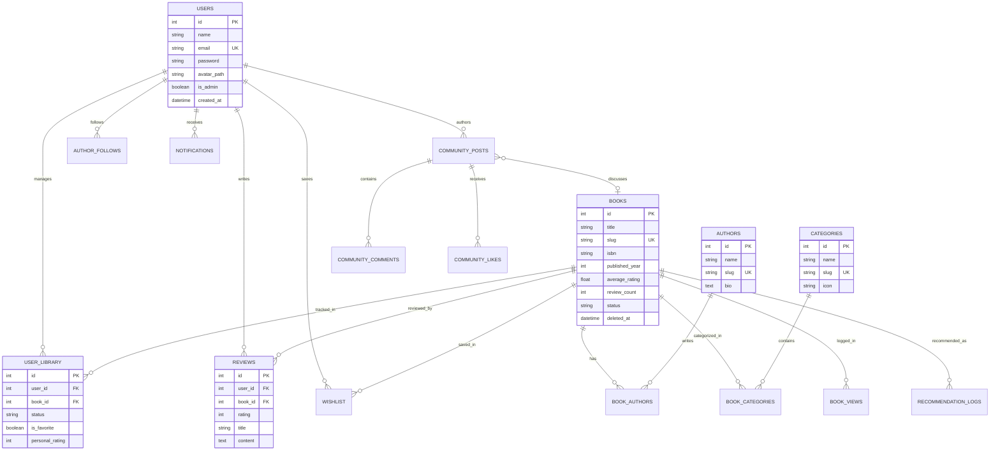
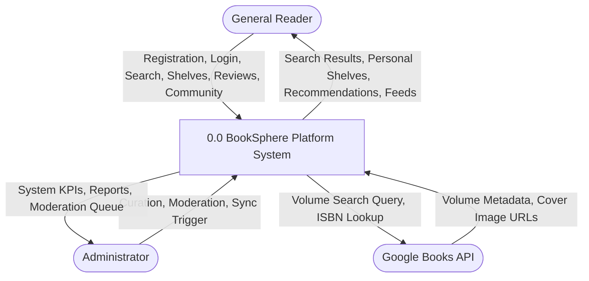
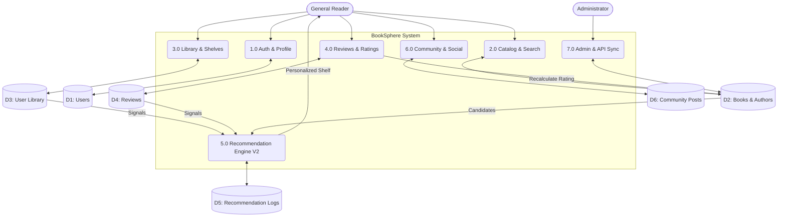
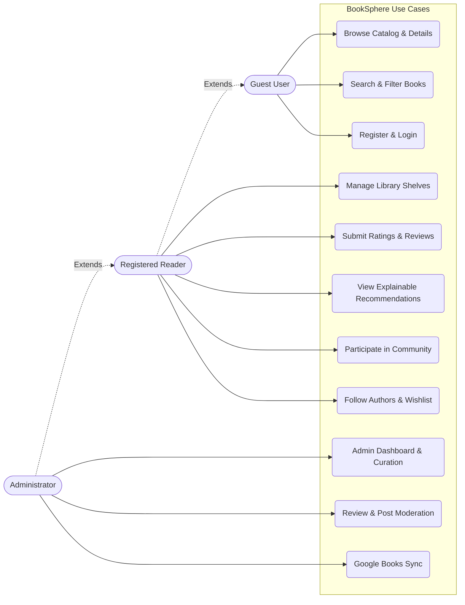
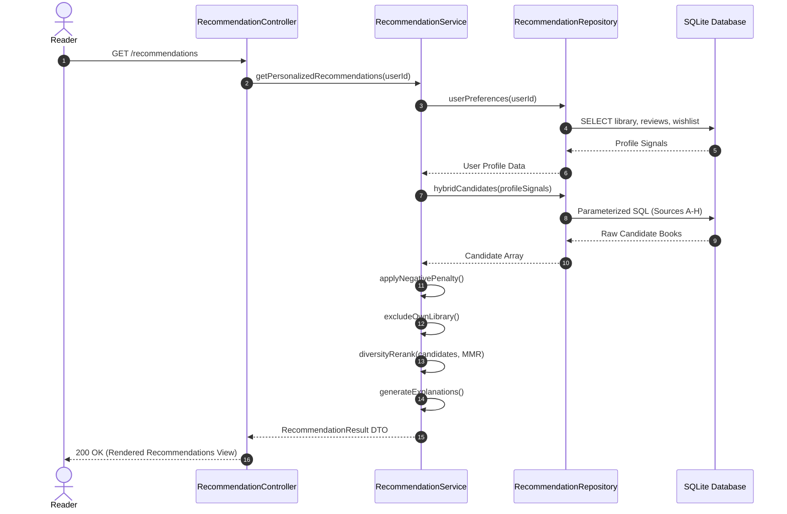

# DIAGRAM SPECIFICATIONS

This document provides formal diagram specifications in both Mermaid notation and structured ASCII format for all system diagrams required in the BookSphere project report.

---

## 1. Entity-Relationship (ER) Diagram

---

## 2. Context-Level DFD (Level 0)

---

## 3. Level-1 Data Flow Diagram (DFD)

---

## 4. Use Case Diagram

---

## 5. Sequence Diagram: Recommendation Retrieval

